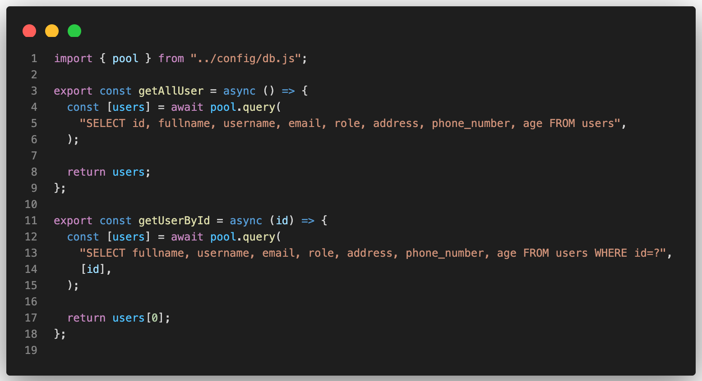
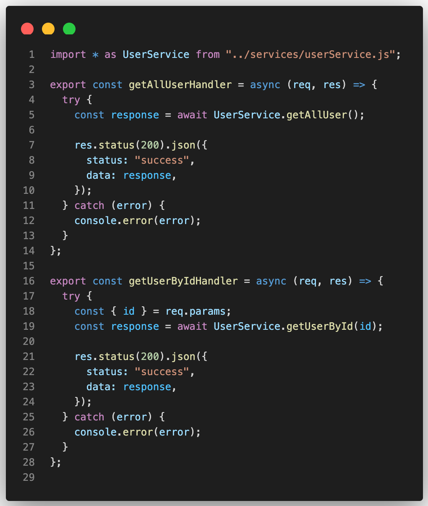
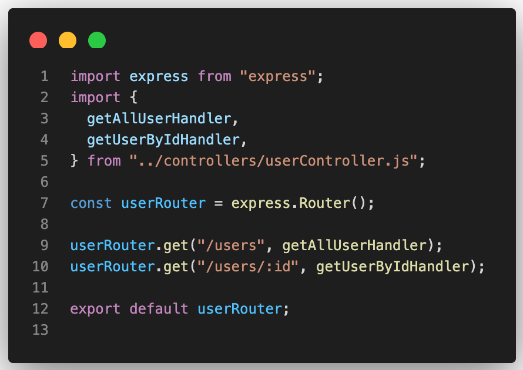

# Refactor Handlers ke Controller–Service Pattern

## 🎯 Tujuan
Memisahkan logika `request/response` (controller) dan logika bisnis/database (service), agar kode lebih rapi, mudah dibaca, dan siap dikembangkan.

---

## 1. Struktur Sebelum Refactor

Awalnya, semua logika aplikasi masih berada di dalam satu folder `handlers/`.

```bash
phone_store/
├── node_modules/              # Folder dependensi NPM
├── package.json               # Info & script project
├── package-lock.json          # Lock versi dependensi
└── src/                       # Source utama aplikasi
    ├── config/                # Koneksi & konfigurasi database
    │   └── db.js
    │
    ├── handlers/              # Semua logika masih digabung di sini
    │   ├── productHandler.js
    │   └── userHandler.js
    │
    ├── routes/                # Routing tiap resource (user, product, dll)
    │   ├── productRoute.js
    │   └── userRoute.js
    │
    └── server.js              # Entry point Express

```

## 2. Ilustrasi Pemisahan Handler Menjadi Controller & Service


Sebelum refactor, satu file handler menangani semuanya — mulai dari menerima request, memproses logika bisnis, hingga mengakses database.

Kita memisahkannya menjadi dua lapisan agar tanggung jawab lebih jelas:

- Controller: fokus menangani request dan response dari client

- Service: fokus pada logika bisnis dan interaksi database


## 3. Tambahkan Folder Controller dan Service
Sekarang kita mulai memisahkan logika dari handlers/ menjadi dua folder baru:
- `controllers/` untuk menangani *request* & *response*

- `services/` untuk menangani *logika bisnis* & *query database*

Buat struktur seperti berikut:

```bash

src/
├── config/
│   └── db.js
│
├── controllers/
│   └── userController.js      # Menangani request & response user
│
├── services/
│   └── userService.js         # Menangani logika bisnis & query
│
├── routes/
│   └── userRoute.js
│
├── handlers/
│   ├── productHandler.js
│   └── (lama) userHandler.js  # Akan digantikan oleh controller & service
│
└── server.js

```

💡 Catatan:
> Untuk sementara, biarkan file lama (userHandler.js) tetap ada agar kita bisa menyalin logika yang sebelumnya sebelum dihapus.

## 4. Tambahkan File userService.js dan userController.js

### - File `userService.js`
File ini berisi logika bisnis dan query ke database.
Buka file nya di `src/services/userService.js`.



### - File `userController.js`
File ini akan menjadi penghubung antara route dan service.
Controller bertugas menerima request, memanggil service, lalu mengembalikan response ke client.

Buka file nya di `src/controllers/userController.js`.



## 5. Update Route untuk Menggunakan Controller
Sekarang ubah `src/routes/userRoute.js` agar tidak lagi memakai `handlers/usersHandler.js`, melainkan `controllers/userController.js`.

Sekarang buka file nya di `src/routes/userRoute.js`.



💡 Catatan:
> Untuk sementara, cukup ubah endpoint GET /users dan GET /users/:id.
> Endpoint POST, PUT, dan DELETE akan ikut dipindahkan setelah semua service dan controller-nya siap.

---
## ✅ Kesimpulan
Dengan memisahkan handler menjadi controller dan service, kode menjadi:
- Lebih mudah diuji (testing)
- Lebih mudah dikembangkan
- Mengikuti pola arsitektur modern seperti MVC