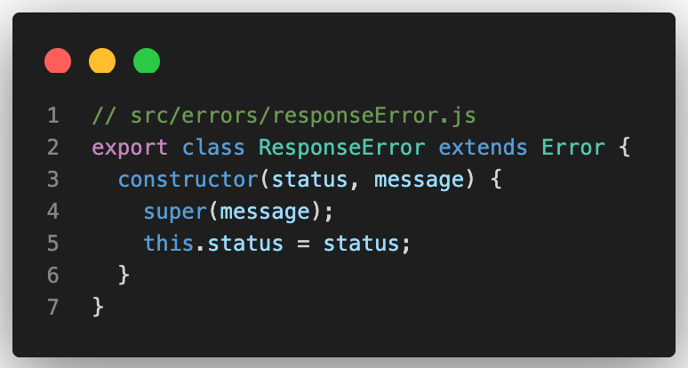
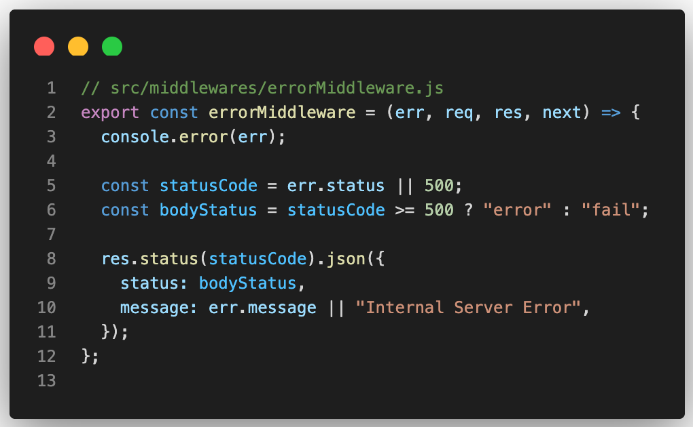
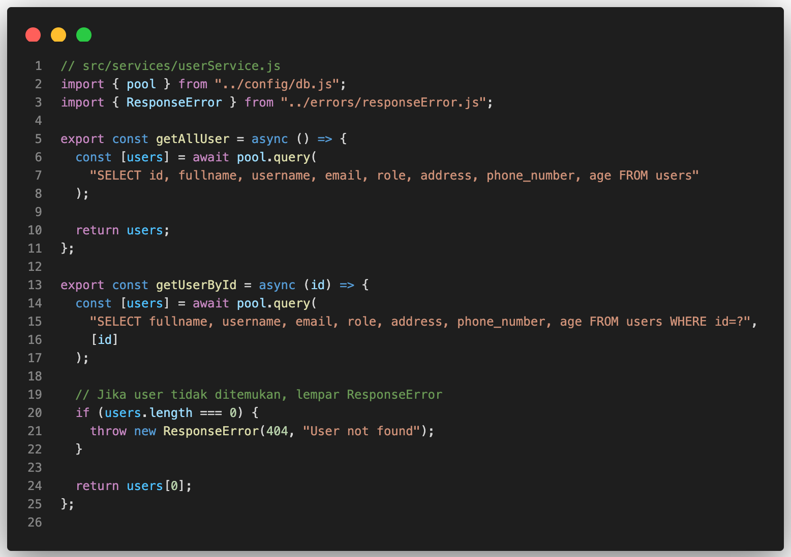
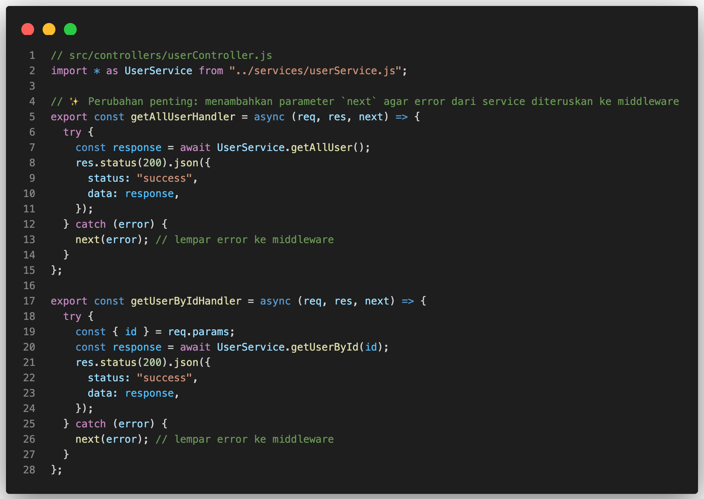
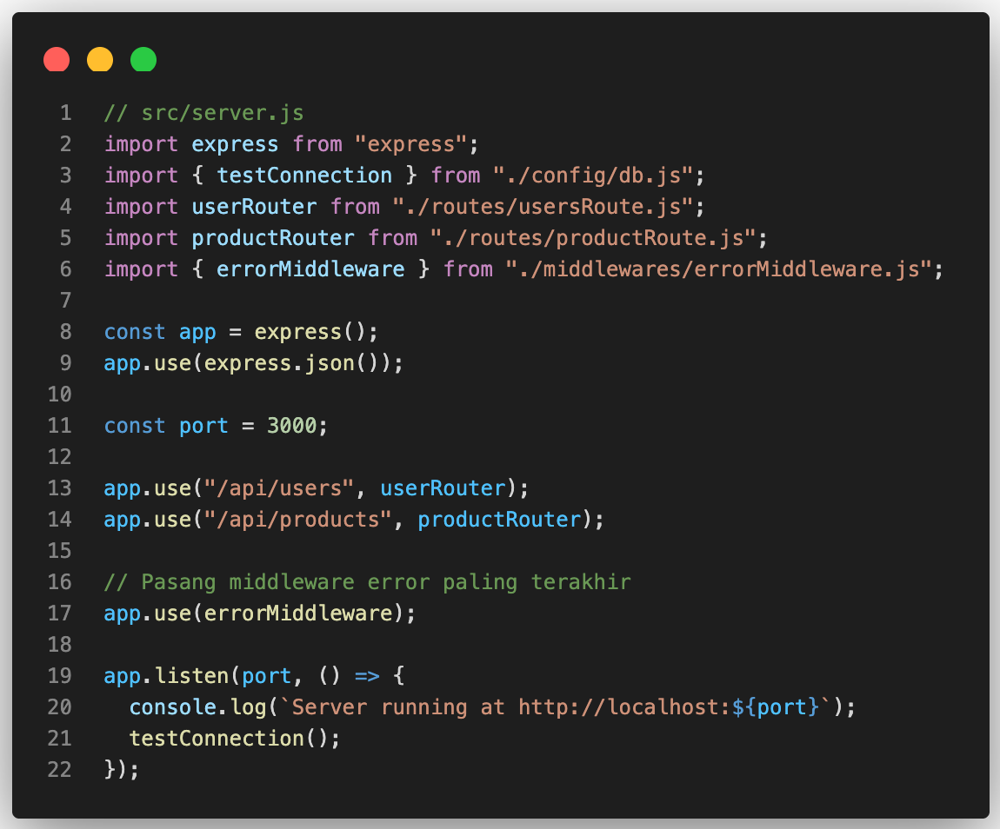

# Menerapkan Error Handling dengan Custom Error dan Middleware

## 🎯 Tujuan
Memisahkan penanganan error dari service dan controller sehingga aplikasi lebih rapi, konsisten, dan mudah dipelihara.

---

## 1. Buat Folder untuk Error Handling

```bash
src/
└── errors/
    └── responseError.js # Custom error class
```

Dan isi file `responseError.js` dengan kode berikut:



Penjelasan
> **ResponseError** adalah custom error class yang menyimpan status HTTP dan pesan error.
> Service dapat melempar error ini sehingga controller dan middleware bisa menanggapi secara konsisten.


## 2. Buat Folder Middleware untuk Menangani Error

```bash
src/
└── middlewares/
    └── errorMiddleware.js # Middleware global untuk menangani error
```

Lalu isi file `errorMiddleware.js` dengan kode berikut:



Penjelasan:
> Middleware ini menangani semua error yang dilempar dari controller atau service.

> Ia mengirimkan respons JSON yang konsisten ke client dengan format `{ status, message }`.

## 3. Update Service untuk Menggunakan Custom Error

Di file `userService.js` sebelumnya, tambahkan `ResponseError` yang sudah dibuat:




💡 Komentar perubahan:

> Menambahkan pengecekan data kosong.
> Melempar error dengan status dan pesan spesifik agar controller tidak perlu menangani secara manual.

## 4. Update Controller untuk Meneruskan Error ke Middleware

Di file `userController.js` sebelumnya, ubah menjadi:




💡 Komentar perubahan:

> Sebelumnya controller hanya (req, res).

> Menambahkan next memungkinkan controller meneruskan error ke middleware global, sehingga error handling terpusat dan konsisten.

## 5. Pasang Middleware Error di `server.js`

Ubah file `server.js` untuk menambahkan middleware error:




💡 Komentar perubahan:

> Middleware error harus dipasang paling akhir agar menangkap semua error dari route dan controller.

> Memastikan semua error dikembalikan dengan format JSON yang konsisten.

## 6. Contoh Respons ke Client

- Data ditemukan:
```json
{
  "status": "success",
  "data": {
    "fullname": "Samsul Bahri",
    "username": "samsul",
    "email": "samsul@example.com",
    "role": "admin"
  }
}

```

- User tidak ditemukan:
```json
{
  "status": "fail",
  "message": "User not found"
}

```

- Error tak terduga (misal DB error):
```json
{
  "status": "error",
  "message": "Internal Server Error"
}

```

---
## ✅ Kesimpulan
Dengan menerapkan custom error dan middleware:
- Service hanya fokus pada logika dan query database.
- Controller hanya fokus pada menerima request dan mengirim response.
- Middleware error menangani semua error secara konsisten.
- Kode menjadi lebih rapi, mudah diuji, dan mudah dikembangkan.
