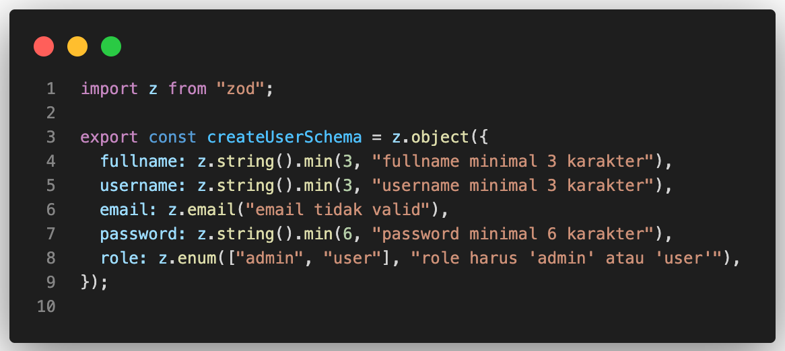
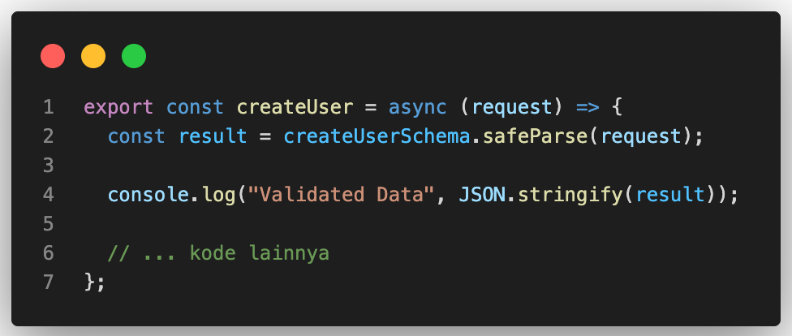
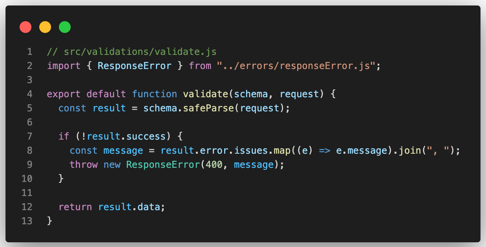
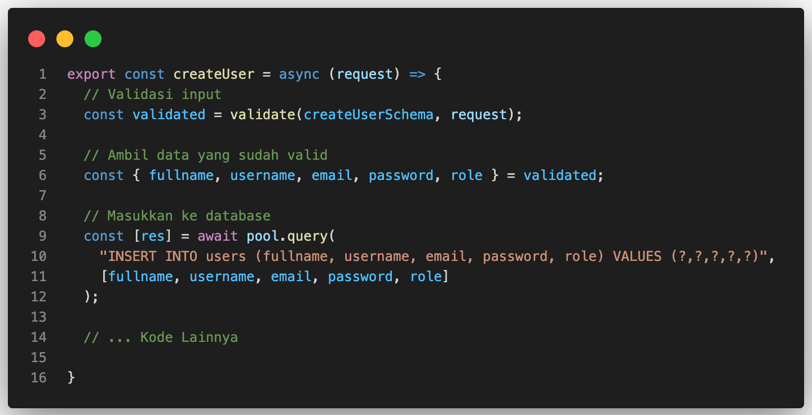

# Menerapkan Validasi Input dengan Zod di Express.js

## 🎯 Tujuan
Memisahkan validasi input dari service dan controller agar:
- Validasi lebih konsisten.
- Kode lebih rapi dan mudah dipelihara.
- Error validasi ditangani dengan format `JSON` yang seragam.

---

## 1. Install Zod

```bash
npm install zod
```

Keterangan:
> Zod adalah library untuk validasi schema data dengan TypeScript/JavaScript. Bisa digunakan untuk request body, query, params, dll.

---

## 2. Buat Folder dan File Validasi

```bash
src/
└── validations/
    └── userValidation.js # Berisi schema validasi data user
```

## 3. Buat Schema untuk Create User

Di file `userValidation.js`, isi dengan:



Penjelasan:
- `z.object({...})` → mendefinisikan struktur object.
- `z.string().min(3, "...")` → string minimal 3 karakter.
- `z.email("...")` → harus email valid.
- Semua field wajib diisi (untuk create user).

## 4. Test Schema di Service

Di `userService.js`, kita akan jalankan validasi di `createUser` dan log hasilnya sebelum diproses:




Contoh `log` jika input tidak valid:
```json
{
  "success": false,
  "error": {
    "name": "ZodError",
    "message": "[{\"path\":[\"fullname\"],\"message\":\"fullname minimal 3 karakter\"}]"
  }
}
```

Penjelasan log:
- `safeParse()` mengembalikan { success, data?, error? }.
- Jika `success = true` → data valid ada di result.data. 
- Jika `success = false` → input tidak valid.
- `error.name: "ZodError"` → tipe error dari Zod.
- `message` → detail field yang bermasalah:
  - `path: ["fullname"]` → field yang error.
  - `message: "fullname minimal 3 karakter"` → pesan validasi dari schema.


## 5. Buat Helper Validasi
Supaya tidak menulis kode validasi berulang, kita bisa dengan membuat helper:



## 6. Implementasi Helper di Service
Sebelum query database, kita gunakan helper validate untuk memastikan input sesuai schema. Service tetap fokus ke logika database, validasi ditangani terpusat.

Buka file `userService.js` dan pada method `createUser`, gunakan helper `validate` seperti ini:



Penjelasan:
- `validate(schema, request)` otomatis memeriksa input.
- Jika input tidak valid, helper melempar `ResponseError` → ditangani oleh `middleware error`.
- Jika `valid`, data siap digunakan untuk `query database`.
- Dengan cara ini, service tetap bersih dan fokus pada logika database, bukan validasi.


## Kesimpulan

Dengan menggunakan Zod di dalam proyek Express.js, kita mendapatkan beberapa keuntungan:

- ✅ Validasi input menjadi terpusat dan konsisten.

- ✅ Kode service dan controller menjadi lebih bersih karena tidak perlu menangani validasi manual.

- ✅ Error validasi dapat ditampilkan dalam format JSON yang seragam, sehingga mudah digunakan oleh frontend.

- ✅ Menambahkan atau mengubah aturan validasi dapat dilakukan dengan mudah dan cepat hanya di file schema.