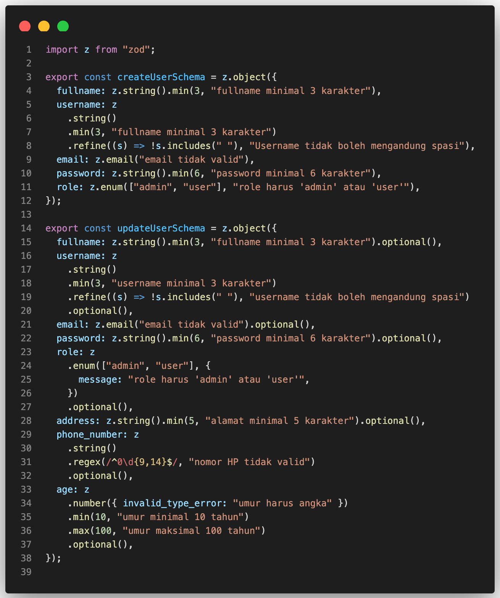
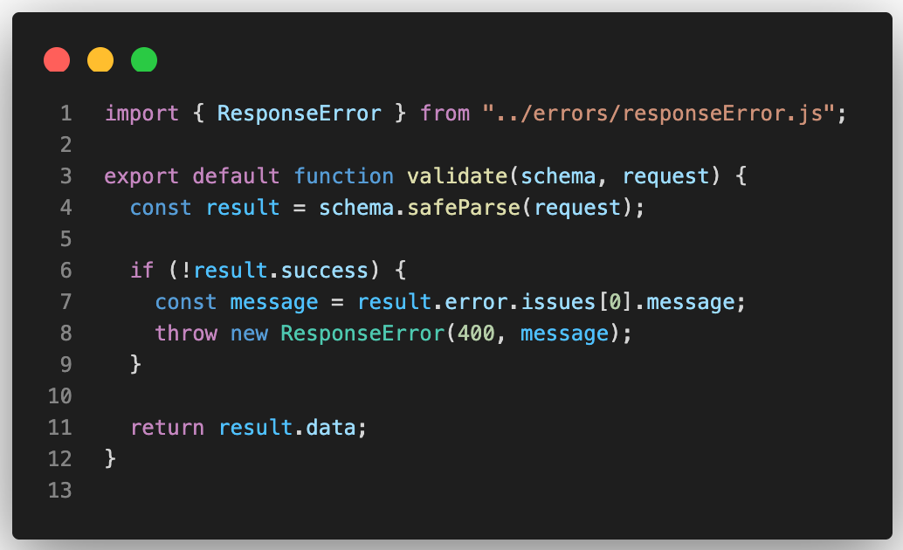

# Menerapkan Validasi Input dengan Zod di Express.js

## 🎯 Tujuan

Memisahkan validasi input dari service dan controller agar:

- Validasi lebih konsisten.
- Kode lebih rapi dan mudah dipelihara.
- Error validasi ditangani dengan format `JSON` yang seragam.

---

## 1. Install Zod

```bash
npm install zod
```

Keterangan:

> Zod adalah library untuk validasi schema data dengan TypeScript/JavaScript. Bisa digunakan untuk request body, query, params, dll.

---

## 2. Buat Folder dan File Validasi

```bash
src/
└── validations/
    └── userValidation.js # Berisi schema validasi data user
```

## 3. Buat Schema untuk Create dan Update User

Di file `userValidation.js`, isi dengan:



Penjelasan:

#### a. Schema `createUserSchema`

Digunakan saat membuat user baru.  
Semua field **wajib diisi**, misalnya:

- `fullname` → minimal 3 karakter.
- `username` → tidak boleh mengandung spasi.
- `email` → harus format email valid.
- `role` → hanya boleh `'admin'` atau `'user'`.

#### b. Schema `updateUserSchema`

Digunakan saat mengubah data user.  
Semua field **bersifat opsional**, tapi jika dikirim:

- Harus tetap sesuai aturan (misal: `fullname` tetap minimal 3 karakter).
- `phone_number` harus format `08xxxxxxxxxx` (antara 10–15 digit).
- `age` harus angka antara 10 dan 100.

## 4. Test Schema di Service

Di `userService.js`, kita akan jalankan validasi di `createUser` dan log hasilnya sebelum diproses:


Contoh `log` jika input tidak valid:

```json
{
  "success": false,
  "error": {
    "name": "ZodError",
    "message": "[{\"path\":[\"fullname\"],\"message\":\"fullname minimal 3 karakter\"}]"
  }
}
```

Penjelasan log:

- `safeParse()` mengembalikan { success, data?, error? }.
- Jika `success = true` → data valid ada di result.data.
- Jika `success = false` → input tidak valid.
- `error.name: "ZodError"` → tipe error dari Zod.
- `message` → detail field yang bermasalah:
  - `path: ["fullname"]` → field yang error.
  - `message: "fullname minimal 3 karakter"` → pesan validasi dari schema.

## 5. Buat Helper Validasi

Supaya tidak menulis kode validasi berulang, kita bisa dengan membuat helper:

```bash
src/
└── validations/
    └── userValidation.js # Sebelumnya
    └── validate.js       # Helper untuk eksekusi validasi & error handling
```



Penjelasan:

- `schema.safeParse(request)` → memeriksa apakah data request sesuai dengan schema Zod.

- `result.success` → bernilai true jika valid, false jika tidak.

- Jika tidak valid (!result.success):

  - Ambil pesan error `pertama` dari result.error.issues[0].message.

  - Lempar `ResponseError(400, message)` agar middleware error menanganinya.

- Jika valid, kembalikan result.data sebagai hasil data yang sudah terverifikasi.

## 6. Implementasi Helper di Service

Sebelum query database, kita gunakan helper validate untuk memastikan input sesuai schema. Service tetap fokus ke logika database, validasi ditangani terpusat.

1. Buka file `userService.js` dan pada method `createUser`, gunakan helper `validate` seperti ini:
   

2. Lalu pada method `updateUser`, gunakan helper `validate` seperti ini:
   

Penjelasan:

- `validate(schema, request)` otomatis memeriksa input.
- Jika input tidak valid, helper melempar `ResponseError` → ditangani oleh `middleware error`.
- Jika `valid`, data siap digunakan untuk `query database`.
- Dengan cara ini, service tetap bersih dan fokus pada logika database, bukan validasi.

## 7. Contoh Response Error

Jika input tidak valid saat create user, response JSON dari API:

```json
{
  "status": "fail",
  "message": "fullname minimal 3 karakter"
}
```

## Kesimpulan

Dengan menggunakan Zod di dalam proyek Express.js, kita mendapatkan beberapa keuntungan:

- ✅ Validasi input menjadi terpusat dan konsisten.

- ✅ Kode service dan controller menjadi lebih bersih karena tidak perlu menangani validasi manual.

- ✅ Error validasi dapat ditampilkan dalam format JSON yang seragam, sehingga mudah digunakan oleh frontend.

- ✅ Menambahkan atau mengubah aturan validasi dapat dilakukan dengan mudah dan cepat hanya di file schema.
